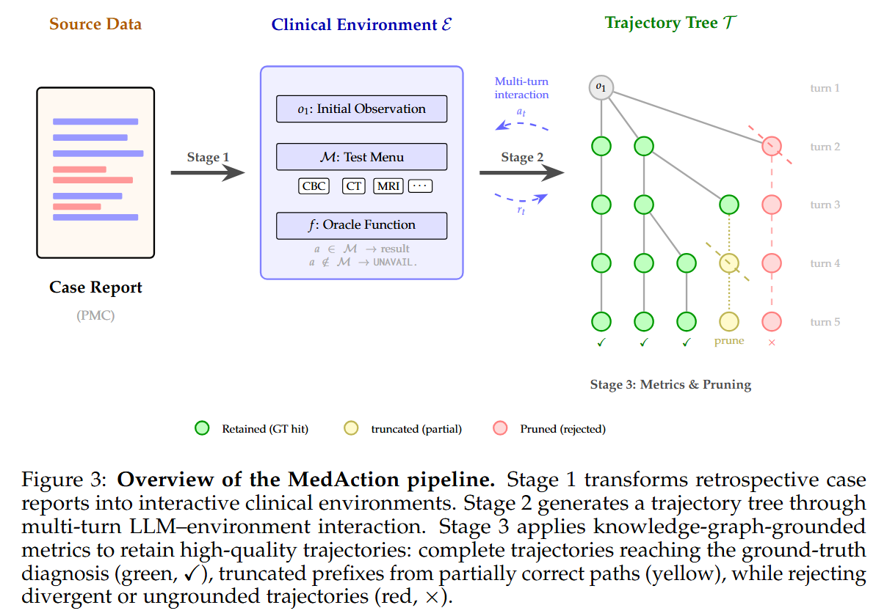

# MedAction: Towards Active Multi-turn Clinical Diagnostic LLMs

Authors: Hsin-Ling Hsu, Zizheng Wang, Donghua Zhang, Nai-Chia Chen, Jerry Wang, Jun-En Ding, Chia-Hsuan Hsu, Guoan Wang, Feng Liu, Fang-Ming Hung, Chenwei Wu, Liyue Shen.

## 🚧 Code and data will be released soon. Stay tuned!



## Abstract

Most existing LLM diagnoses are evaluated on static, single-turn settings where complete patient information is provided upfront, an oversimplification of real clinical practice. We study active diagnosis: the real-life clinical process of starting from initial observation, ordering tests, interpreting results, and updating a differential diagnosis across multiple turns. Through systematic analysis, we identify three recurring failure modes in current LLMs — ungrounded test ordering, unreliable diagnostic update, and degraded multi-turn coherence — that together reveal a core deficit: existing medical training data teaches models to reason from complete information but not to act under evolving, partial evidence. To address this gap, we introduce MedAction, a tree-structured distillation pipeline that synthesizes diverse and high-quality multi-turn diagnostic trajectories via LLM–environment interaction. We propose two knowledge-graph-grounded metrics to filter trajectory quality: Disease Trajectory Consistency (DTC), which tracks whether the model's hypothesis converges toward the correct diagnosis, and Reasoning–Action Consistency (RAC), which verifies that belief updates are driven by gathered evidence. Using this pipeline, we construct MedAction-32K, a dataset of 32,681 trajectories from 2,896 PMC cases. Fine-tuning an 8B model on MedAction-32K achieves state-of-the-art performance among open-source models on both MedR-Bench and our curated MedAction-300-Hard benchmark, pushing the edge for open-source medical LLMs.


<!-- ## Citation

If you use this dataset in your research, please cite our paper:

```bibtex

``` -->
